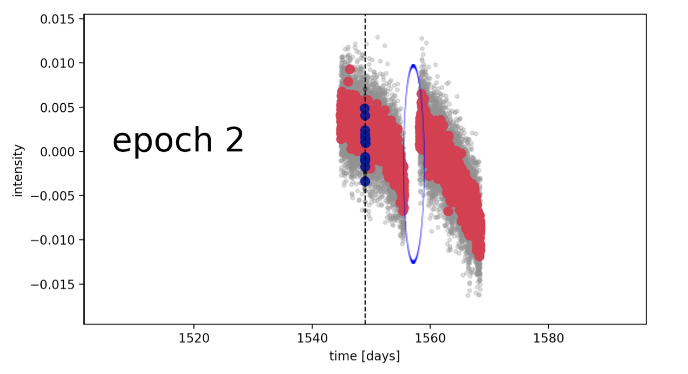
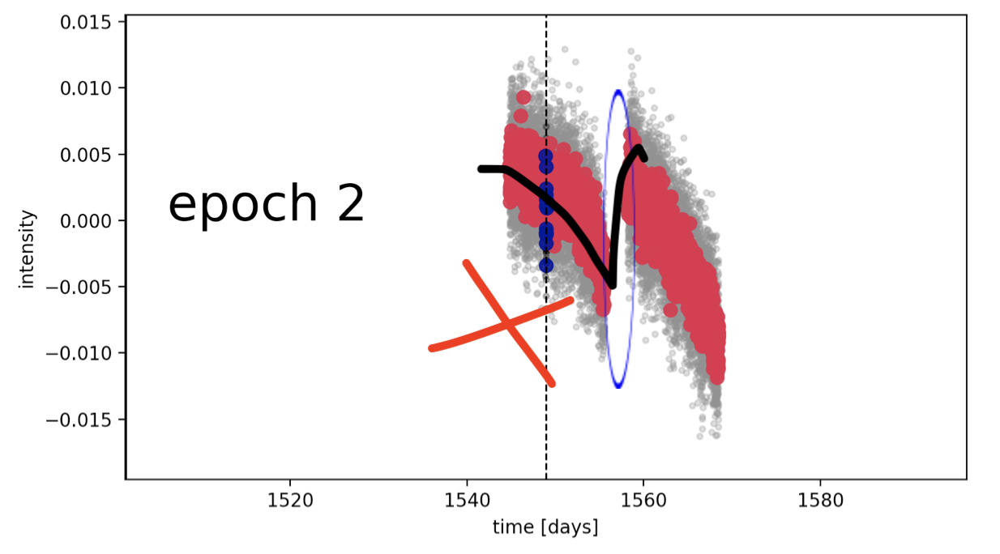
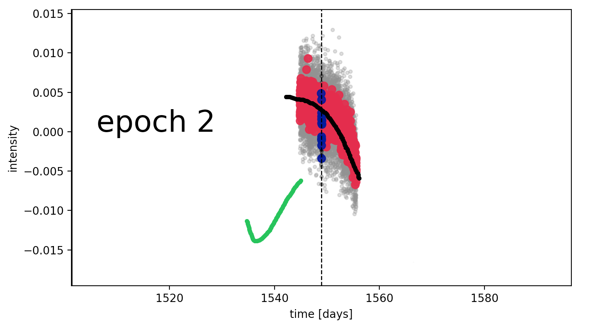

Identifying Problem Times
==========================

.. role:: blue
   :class: blue

.. role:: red
   :class: red

.. raw:: html

   

This tutorial demonstrates how to identify and label problem times (e.g., flux jumps, discontinuities) in light curve data, labeling problem times is a crucial step in the pre-processing of light curves.

To detrend :term:`Light Curve` data, we must account for **structured noise**, i.e., sources of error
resulting from instrumentation noise, :term:`Stellar Activity`, and similar effects. Accounting for
these issues prevents them from interfering with the task of distinguishing normal :term:`Stellar Activity`
from a potential :term:`Transit`.

We do this by identifying times in the data where **discontinuities** occur, also known as
":term:`Problem Times`" or ":term:`Jump Times`." These discontinuities result from structured noise: for
example, a telescope re-pointing its camera at a star may cause more photons to be detected
than the star actually emits. If these discontinuities are not flagged, fitting algorithms will be
unable to reconcile abrupt changes in measurements, making it impossible to statistically verify
whether a stellar :term:`Transit` is real.

.. note::

  Examples of systems with discontinuities, shown with the sudden jump circled in blue: :term:`TOI` 1823.01, :term:`TOI` 798.01.

  .. figure:: images/TOI182301.png
    :alt: Example of a discontinuity in TOI 1823.01
    :width: 80%
    :align: center

    Discontinuity example from TOI 1823.01.

  .. figure:: images/TOI79801(1).png
    :alt: Example of a discontinuity in TOI 798.01
    :width: 80%
    :align: center

    Discontinuity example from TOI 798.01.

Introduction to Discontinuities
-------------------------------

Look for **abrupt changes** in the data, such as anything that would make it difficult to fit a smooth
polynomial function through. A useful question to ask while labeling:

   *Could a function smoothly travel through this data without any jumps or sharp bends?*

Using :term:`TOI` 798.01 as an example:

   Discontinuity example from TOI 798.01.

The :blue:`blue` data is the potential transit data, while the :red:`red` data is the (binned) non-transit data. Binned means that the average of the data over some window has been taken so that it’s easier to detect discontinuities. Here you can already see a break in the data, which is marked by the blue circle.

If you tried to draw a smooth polynomial function through it, it would break and become a step function at this discontinuity!

   Broken polynomial fit at the discontinuity.

So, we have to make sure that jump doesn’t happen. What we do is grab the non-transit, non-problematic data from the timestep where it starts, then terminate the selection at the time step right before the jump in data occurs. The time step at/before the jump is called our "problem time," or "jump time."

What we want ultimately is something like this:

   Final selected data for detrending.

Which is the data we will use for detrending!

Workflow for Labeling a Problem Time
~~~~~~~~~~~~~~~~~~~~~~~~~~~~~~~~~~~~~

1. Identify the region of data that looks most continuous **and** contains the :term:`Transit`.
2. Drag the time slider to the leftmost edge of that continuous region. A vertical line will
   track the slider position.
3. The time value where that line intersects the data is the **problem time**.
4. Click **Save Time** to record it.
5. Close the figure to advance to the next :term:`Epoch`.

.. tip::

  If a break in the data is minor, for example when the data still follows a smooth sine-wave shape on
  either side, a polynomial function may be able to fit through it. In that case, you do **not** need to save a :term:`Problem Times`.

Example Walkthrough: Labeling TOI-4328
---------------------------------------

What Happens Behind the Scenes?
~~~~~~~~~~~~~~~~~~~~~~~~~~~~~~~~

Code Structure & API Documentation
------------------------------------

How to Run the Code
~~~~~~~~~~~~~~~~~~~~

API Reference
--------------

``find_flux_jumps()``
~~~~~~~~~~~~~~~~~~~~~~

.. code-block:: python

   find_flux_jumps(
       star_id,
       flux_type,
       save_to_directory,
       show_plots,
       TESS=False,
       Kepler=False,
       user_periods=None,
       user_t0s=None,
       user_durations=None,
       planet_number=1,
       mask_width=1.3,
       no_jump_times=False
   )

Queries the :term:`Exoplanet Archive` and :term:`SIMBAD`, retrieves :term:`Light Curve` data, and enables
interactive labeling of :term:`Jump Times`/:term:`Problem Times`.

**Parameters**

.. list-table::
   :header-rows: 1
   :widths: 25 75

   * - Parameter
     - Description
   * - ``star_id``
     - :term:`TOI` or :term:`KOI` identifier string.
   * - ``flux_type``
     - ``"pdc"``, ``"sap"``, or ``"both"``.
   * - ``save_to_directory``
     - Path to save output files.
   * - ``show_plots``
     - Boolean; whether to display non-jump-time plots.
   * - ``TESS``
     - *(optional)* Boolean flag for :term:`TESS` mission data. Default ``False``.
   * - ``Kepler``
     - *(optional)* Boolean flag for :term:`Kepler` mission data. Default ``False``.
   * - ``user_periods``
     - *(optional)* Manually supplied orbital period(s). Default ``None``.
   * - ``user_t0s``
     - *(optional)* Manually supplied T0 value(s). Default ``None``.
   * - ``user_durations``
     - *(optional)* Manually supplied :term:`Transit` duration(s). Default ``None``.
   * - ``planet_number``
     - Planet number to analyze. Default ``1``.
   * - ``mask_width``
     - :term:`Transit` mask width multiplier. Default ``1.3``.
   * - ``no_jump_times``
     - If ``True``, skips :term:`Jump Times` labeling. Default ``False``.

**Returns**

.. code-block:: python

   x_epochs, y_epochs, yerr_epochs, mask_epochs,
   mask_fitted_planet_epochs, problem_times,
   t0s, period, duration, cadence

Helpful Tips & Tricks
-----------------------

Multiplanetary Systems
~~~~~~~~~~~~~~~~~~~~~~~

Tracking Progress
~~~~~~~~~~~~~~~~~

It is useful to keep track of which :term:`TOI`s you have completed. Update the
*"problem times labeled?"* column in the provided Google Sheets :term:`TOI` list after finishing each
object.

.. note::
   The following sections are under construction: terminal commands, shell scripts, editing
   CSVs, and edge cases.

Debugging
----------

Bring up any issues found while labeling in **deWobbler** so Daniel can review them.

Useful Links
-------------

- `TESS Column Definitions <https://exoplanetarchive.ipac.caltech.edu/docs/API_TOI_columns.html>`_
- `:term:\`ExoFOP\`` <https://exofop.ipac.caltech.edu/>`_
- `:term:\`MAST Archive\`` <https://mast.stsci.edu/>`_
- `NASA :term:\`Exoplanet Archive\`` <https://exoplanetarchive.ipac.caltech.edu/>`_
- `:term:\`SIMBAD\`` <https://simbad.u-strasbg.fr/simbad/>`_
